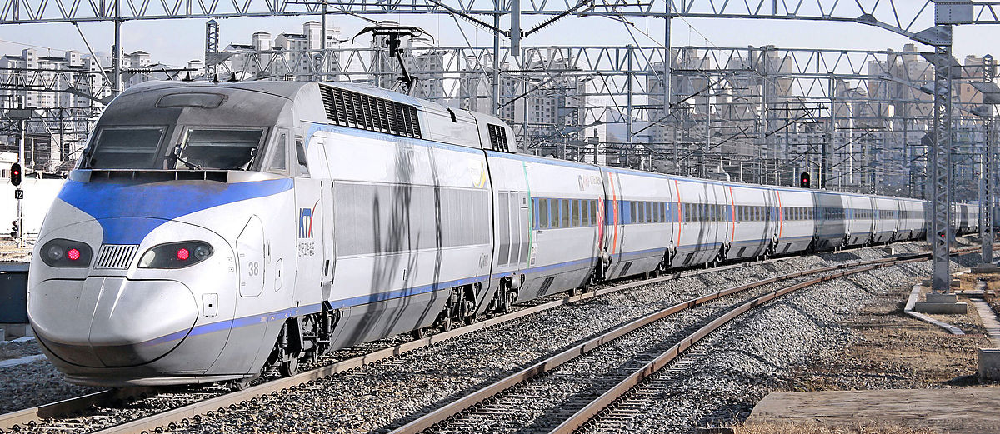
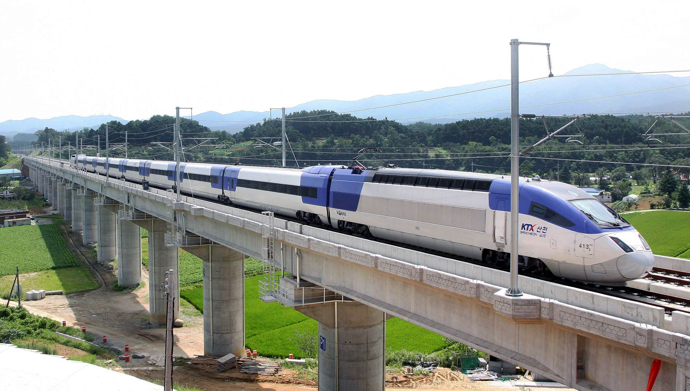
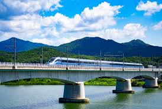
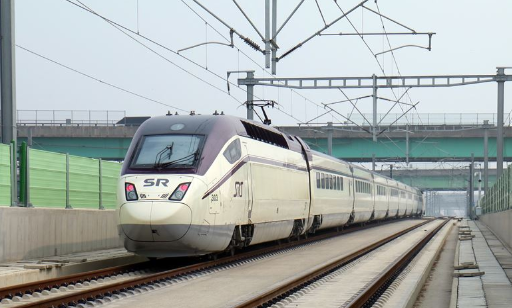

# KTX Ridership Analysis & Pattern Recognition
## Contributors:
- ### Louis Sungwoo Cho (조성우)

# Project Description
This project is about analyzing and predicting KTX (Korea Train eXpress) passenger ridership and image classification of high-speed trains in South Korea. The combined datasets were acquired from KORAIL (한국철도공사) and SRT (수서고속철도주식회사). 

- #### Dataset Source: https://www.index.go.kr/potal/main/EachDtlPageDetail.do?idx_cd=1252

### The image above shows KTX 1 the original French TGV model high-speed train approaching.
- #### Image Source: https://en.wikipedia.org/wiki/Korea_Train_Express

### The image above shows KTX Sancheon the newly developed model by Hyundai Rotem approaching.
- ##### Image Source: https://www.archyworldys.com/only-56-minutes-from-cheongnyangni-to-jecheon-the-faster-and-strongerbullet-train-comes/

- #### Image Source: https://www.etoday.co.kr/news/view/1996363

